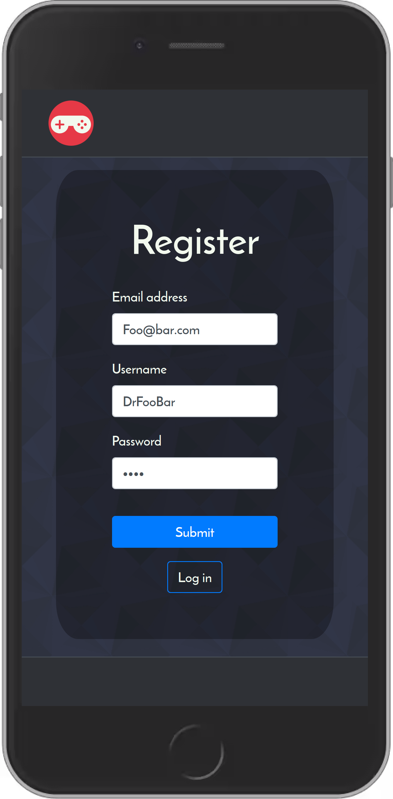
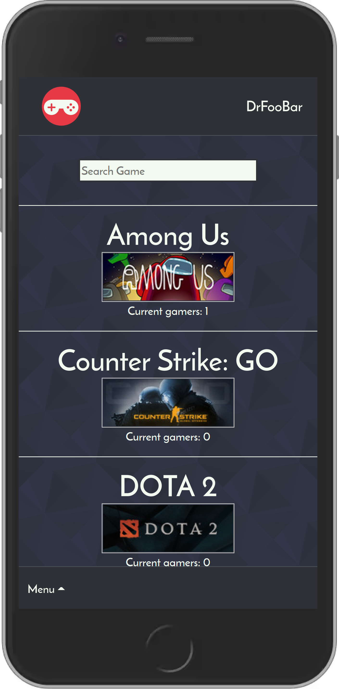
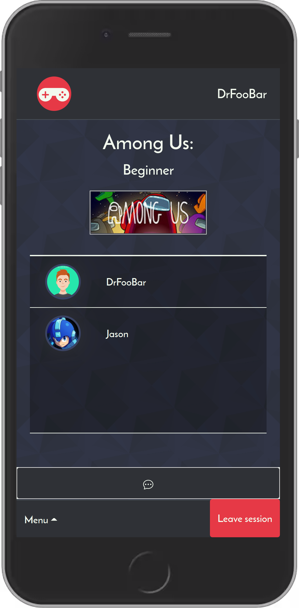
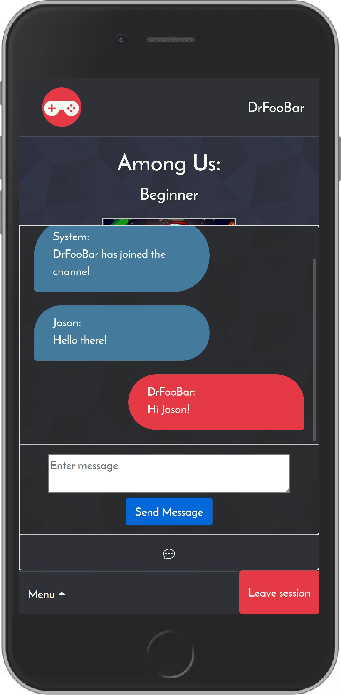
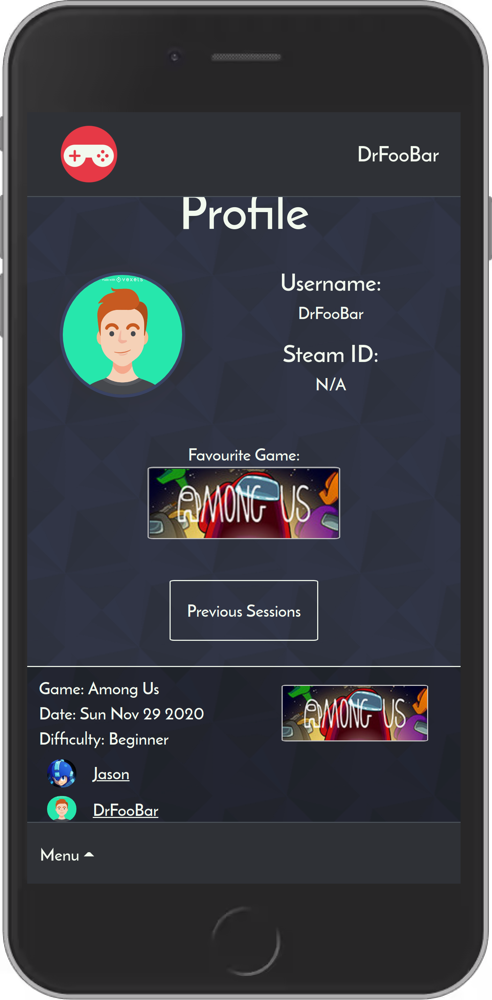
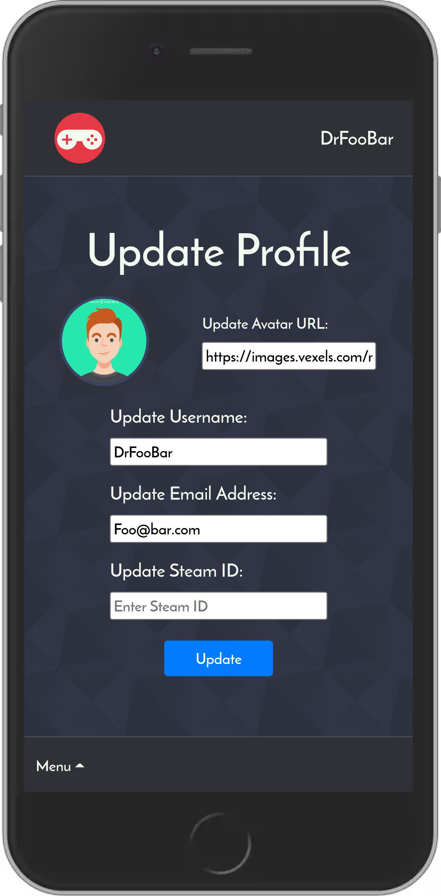

# Lfga.me

Lfga.me is an app built with Node, React, Express and PostGresql that allows gamers to create more intimate and lasting connections than they would through normal matchmaking in games. It is for gamers who are looking for new people to play with. Through Lfga.me gamers can find groups of players based on their prefered level of play, and chat with them. 

### Screenshots:

## Dependencies

### Client
- Node 10.16.x or above
- axios: ^0.21.0
- bootstrap: ^4.5.3
- node-sass: ^4.14.1
- react: ^17.0.1
- react-bootstrap: ^1.4.0
- react-dom: ^17.0.1
- react-router-dom: ^5.2.0
- react-scripts: 4.0.0
- socket.io-client: ^3.0.3
- validator: ^13.1.17
- web-vitals: ^0.2.4

### API
- Node 5.10.x or above
- bcrypt: ^5.0.0,
- cookie-parser: ~1.4.4,
- debug: ~2.6.9,
- express: ~4.16.1,
- jsonwebtoken: ^8.5.1,
- morgan: ~1.9.1,
- pg: ^8.5.1,
- pg-native: ^3.0.0,
- socket.io: ^3.0.3

## Created by:

- Jason Long
- Etienne Le Coent
- Noah Kadish